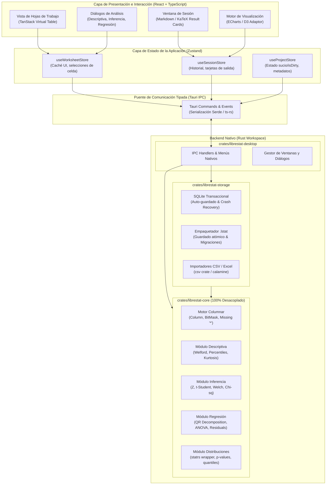

# ARCHITECTURE.md: Arquitectura Técnica de LibreStat

Este documento describe la arquitectura de software, el modelo de componentes, los límites de capas, el diseño del motor de datos y los contratos de interfaz de **LibreStat**.

---

## 1. Visión Arquitectónica General

LibreStat adopta una arquitectura modular, local-first y fuertemente desacoplada, dividida en dos grandes mundos conectados por un puente de comunicación tipado (IPC):
1. **Frontend / Presentación**: Aplicación web de una sola página (SPA) empaquetada en el WebView nativo mediante **Tauri v2**, construida con **React**, **TypeScript**, **Tailwind CSS** y **Zustand**.
2. **Backend Nativo**: Workspace de **Rust** compuesto por tres crates independientes:
   - `crates/librestat-core`: Motor estadístico y matemático puro.
   - `crates/librestat-storage`: Persistencia transaccional (SQLite) y empaquetador de proyectos (`.lstat`).
   - `crates/librestat-desktop`: Integración con Tauri v2, enrutador de comandos IPC y diálogos nativos.

---

## 2. Diagrama de Contenedores y Componentes (C4)



---

## 3. Límites de Capas y Reglas de Dependencia

1. **Inmutabilidad y Aislamiento del Motor Estadístico (`librestat-core`)**:
   - `librestat-core` es un crate de Rust puro. No depende de Tauri, ni de SQLite, ni de componentes gráficos.
   - Puede compilarse como CLI, como biblioteca nativa o como módulo WebAssembly.
   - Se prueba al 100% con `cargo test` sin necesidad de levantar ventanas gráficas.
2. **Capa de Presentación (React)**:
   - Los componentes de React se centran exclusivamente en la composición visual y la captura de eventos de usuario.
   - **Queda prohibido** realizar cálculos estadísticos pesados en React.
   - Guía estricta de tamaño: ningún componente debe superar las **250 líneas**.
3. **Flujo Unidireccional del Estado**:
   - Los stores de Zustand orquestan el estado de la UI y delegan las mutaciones de datos pesados al backend de Rust mediante el cliente IPC.
4. **Sincronización de Tipos (Rust <-> TypeScript)**:
   - Los contratos de datos (estructuras de análisis, parámetros de prueba, tarjetas de resultados y especificaciones de gráficos) se definen en Rust anotados con `#[derive(TS)]` (vía `ts-rs`), generando automáticamente las definiciones de TypeScript en `packages/librestat-types/`. Cero desincronización de tipos.

---

## 4. Motor de Datos Columnar y Semántica de Valores Faltantes

### 4.1. Representación en Memoria en Rust
Las hojas de trabajo se almacenan en `librestat-core` como colecciones de columnas contiguas:
```rust
pub enum ColumnData {
    Float64 { values: Vec<f64>, validity: BitVec },
    Int64 { values: Vec<i64>, validity: BitVec },
    Text { values: Vec<String>, validity: BitVec },
    DateTime { values: Vec<i64>, validity: BitVec }, // Timestamp UTC
}
```
* **Máscaras de Bits (`BitVec`)**: Cada columna dispone de una máscara contigua de bits para indicar presencia (`1`) o ausencia (`0`) de dato.
* **Convención de Valor Faltante**: Siguiendo la ergonomía de Minitab, los valores numéricos faltantes se representan en la interfaz como un asterisco `*`.
* **Escala Soportada**: Optimizado para hojas de trabajo de hasta 500.000 filas y 200 columnas en memoria de acceso aleatorio (<100MB de RAM).

### 4.2. Virtualización en Frontend
* La interfaz utiliza virtualización de ventana (vía TanStack Virtual o motor de tabla virtualizado).
* Solo se renderizan en el DOM las filas visibles en pantalla (aproximadamente 50 a 100 filas), manteniendo un scroll fluido a 60 FPS independientemente de que la hoja tenga 1.000 o 500.000 filas.

---

## 5. Precisión Numérica y Algoritmos Estadísticos

1. **Momentos y Dispersión (Algoritmo de Welford)**:
   - Se prohíben las sumas ingenuas de cuadrados que provocan cancelación catastrófica. La media y varianza muestral se computan mediante el algoritmo en línea de una pasada de Welford:
     $$M_k = M_{k-1} + \frac{x_k - M_{k-1}}{k}$$
     $$S_k = S_{k-1} + (x_k - M_{k-1})(x_k - M_k)$$
     $$s^2 = \frac{S_n}{n-1}$$
2. **Regresión Lineal y Mínimos Cuadrados (Descomposición QR)**:
   - Se prohíbe calcular $(X^T X)^{-1} X^T y$ directamente.
   - Se emplea descomposición QR mediante reflexiones de Householder proporcionada por `faer`:
     $$X = Q R \implies R \beta = Q^T y$$
     evitando elevar al cuadrado el número de condición $\kappa(X)$.
3. **Distribuciones y Cuantiles**:
   - Evaluación precisa de funciones especiales (Gamma incompleta, Beta incompleta, Erf) mediante `statrs` para calcular p-values y cuantiles de distribuciones Normal, Student-$t$, Chi-cuadrado y $F$.

---

## 6. Persistencia Híbrida y Formato de Archivo `.lstat`

El almacenamiento de LibreStat combina dos mecanismos complementarios:
1. **Almacenamiento Transaccional de Trabajo (SQLite local en WAL mode)**:
   - Almacena el estado de trabajo durante la sesión activa.
   - Auto-guardado periódico en segundo plano.
   - Garantiza recuperación total de la sesión ante fallos del sistema operativo o cortes de energía.
2. **Formato de Archivo de Proyecto (`.lstat`)**:
   - Paquete estándar en formato ZIP con guardado atómico (`.lstat.tmp` seguido de renombrado atómico en el sistema de archivos).
   - Estructura interna:
     ```
     proyecto.lstat
     ├── manifest.json              # Versionado de esquema (schema_version: 1), fecha, metadatos
     ├── worksheets/
     │   ├── sheet_1.bin            # Datos binarios columnares
     │   └── sheet_1_meta.json      # Nombres, tipos, etiquetas de columnas
     ├── session/
     │   └── command_history.jsonl  # Historial cronológico de comandos ejecutados
     └── results/
         ├── result_001.json        # Tablas de salida formateadas
         └── charts/
             └── chart_001.json     # Definiciones LibreStatChartSpec
     ```

---

## 7. Visualización y Sistema Gráfico Declarativo

* **Especificación Semántica (`LibreStatChartSpec`)**:
  - Todo gráfico es una estructura JSON declarativa independiente de la biblioteca de renderizado.
  - Describe: tipo de gráfico, variables asociadas, escalas de ejes, líneas de referencia (ej. $LCL, \bar{X}, UCL$), puntos atípicos destacados y áreas de probabilidad sombreadas.
* **Renderizado**:
  - Implementado mediante un adaptador sobre **Apache ECharts** (Canvas/SVG) para gráficos estadísticos generales y **D3.js** para gráficos especializados (Ishikawa).
* **Exportación de Alta Calidad**:
  - Exportación vectorial nativa a **SVG** y **PDF**, y rasterizado a **PNG de 300 DPI** para publicaciones académicas y reportes industriales.

---

## 8. Seguridad y Modelo Local-First

1. **Aislamiento de Tauri v2**:
   - Las capacidades (`capabilities/`) restringen el acceso al sistema de archivos exclusivamente a las rutas seleccionadas por el usuario mediante diálogos nativos.
2. **Validación de Entradas**:
   - Todo archivo CSV, Excel o `.lstat` se procesa como contenido no confiable, verificando límites de tamaño, encabezados maliciosos y evitando ataques de directory traversal (`../`).
3. **Cero Salida a Red**:
   - La aplicación no abre sockets de red salientes ni requiere conexión a internet para funcionar.
