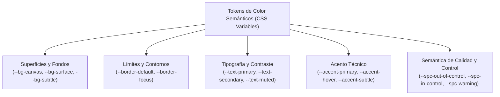

# DESIGN.md: Sistema de Diseño e Identidad Visual de LibreStat

Este documento establece la especificación formal, vinculante y obligatoria de la interfaz de usuario, tokens semánticos, tipografía, componentes y ergonomía de interacción para **LibreStat**.

> [!IMPORTANT]
> **NORMA VINCULANTE**: Todo componente de React, hoja de cálculo, diálogo modal, gráfico o tarjeta de resultados que se incorpore a LibreStat debe acatar estrictamente las directrices, medidas, colores y patrones anatómicos definidos en este documento. Quedan expresamente prohibidos los colores arbitrarios "hardcodeados" y los componentes que rompan la densidad técnica del sistema.

---

## 1. Filosofía de Diseño y Personalidad Visual

LibreStat está diseñado como una **Estación de Trabajo Científica de Alta Densidad** (*Scientific Workstation*), inspirada en la precisión y robustez operativa de Minitab®, pero con una estética contemporánea, sobria y profesional:

1. **Densidad de Información Optimizada**: El usuario debe poder inspeccionar decenas de filas y columnas simultáneamente, así como tablas estadísticas complejas, sin desplazamientos innecesarios ni fatiga visual.
2. **Claridad Numérica Absoluta**: Los datos numéricos son el núcleo del sistema. Todo número se alinea a la derecha con punto decimal alineado verticalmente usando tipografía tabular.
3. **Ergonomía Predecible y Consistente**: Todos los diálogos de análisis siguen exactamente el mismo patrón anatómico de dos columnas. El usuario que aprende a usar una prueba de hipótesis sabe usar cualquier otra herramienta del programa.
4. **Accesibilidad y Confort Visual**: Soporte de temas Claro y Oscuro con fondos diseñados para evitar el deslumbramiento y contraste verificado (mínimo ratio WCAG AA 4.5:1). Paleta gráfica accesible para daltonismo (*Colorblind-safe*).

---

## 2. Tokens Semánticos de Color

El sistema de color se articula mediante variables CSS semánticas aplicadas a través de la paleta **Slate Científica**:



### 2.1. Tabla de Tokens Semánticos (Modo Claro vs Modo Oscuro)

| Token Semántico | Modo Claro (Hex) | Modo Oscuro (Hex) | Rol y Aplicación |
| :--- | :--- | :--- | :--- |
| `--bg-canvas` | `#f8fafc` (Slate-50) | `#090d16` (Deep Navy) | Fondo general de la aplicación anti-fatiga. |
| `--bg-surface` | `#ffffff` (Blanco) | `#0f172a` (Slate-900) | Superficie de hojas de trabajo, diálogos y tarjetas. |
| `--bg-subtle` | `#f1f5f9` (Slate-100) | `#1e293b` (Slate-800) | Cabeceras de columnas, toolbars y filas de nombres. |
| `--bg-hover` | `#e2e8f0` (Slate-200) | `#334155` (Slate-700) | Estados hover en celdas, filas y botones secundarios. |
| `--border-default` | `#e2e8f0` (Slate-200) | `#1e293b` (Slate-800) | Bordes de cuadrícula de hoja, tarjetas y divisores (1px). |
| `--border-focus` | `#2563eb` (Blue-600) | `#3b82f6` (Blue-500) | Anillo de foco de accesibilidad y selección de celda (2px). |
| `--text-primary` | `#0f172a` (Slate-900) | `#f8fafc` (Slate-50) | Texto principal de datos, cabeceras y resultados. |
| `--text-secondary` | `#475569` (Slate-600) | `#94a3b8` (Slate-400) | Subtítulos, etiquetas de campos y timestamps. |
| `--text-muted` | `#94a3b8` (Slate-400) | `#64748b` (Slate-500) | Asterisco `*` de valor faltante, atajos y placeholders. |
| `--accent-primary` | `#2563eb` (Blue-600) | `#3b82f6` (Blue-500) | Color de acción principal, botón [Aceptar] y selecciones. |
| `--accent-hover` | `#1d4ed8` (Blue-700) | `#2563eb` (Blue-600) | Estado hover del acento principal. |
| `--accent-subtle` | `#dbeafe` (Blue-100) | `#1e3a8a` (Blue-950) | Fondo de filas o celdas seleccionadas. |

### 2.2. Semántica Estricta para Control de Calidad (SPC) y Diagnóstico

| Token Semántico | Valor Hex | Significado Estadístico / Industrial |
| :--- | :--- | :--- |
| `--spc-out-of-control` | `#dc2626` (Red-600) | Punto fuera de límites de control ($> UCL$ o $< LCL$), violación de reglas de Nelson, error crítico de supuesto. |
| `--spc-in-control` | `#16a34a` (Green-600) | Proceso bajo control estadístico, prueba no rechazada ($p \ge \alpha$), supuestos cumplidos. |
| `--spc-warning` | `#d97706` (Amber-600) | Zona $2\sigma$ de advertencia, advertencia de normalidad o multicolinealidad moderada. |
| `--spc-center-line` | `#2563eb` (Blue-600) | Línea central de proceso ($\bar{X}, \bar{R}, \text{Mediana}$). |
| `--spc-spec-limit` | `#475569` (Slate-600) | Límites de especificación del cliente ($USL, LSL$) o target nominal. |

---

## 3. Tipografía y Sistema Numérico Tabular

### 3.1. Familias Tipográficas
* **Fuente de Interfaz (UI Stack)**:  
  `font-family: 'Inter', -apple-system, BlinkMacSystemFont, 'Segoe UI', Roboto, sans-serif;`  
  Utilizada en menús, barras de herramientas, títulos, botones y textos descriptivos de diálogos.
* **Fuente Tabular y de Datos (Data & Monospace Stack)**:  
  `font-family: 'JetBrains Mono', ui-monospace, SFMono-Regular, Menlo, Monaco, Consolas, monospace;`  
  `font-feature-settings: "tnum" 1, "zero" 1;`  
  Obligatoria en todas las celdas de la hoja de trabajo, tablas de resultados en la ventana de sesión y ejes de gráficos. Garantiza que el dígito `1` ocupe exactamente el mismo ancho que el `8`, asegurando la alineación vertical milimétrica de las columnas de números.
* **Fórmulas Matemáticas**: Renderizadas con **KaTeX** en notación LaTeX estándar.

### 3.2. Escala Tipográfica de la Estación de Trabajo
* **Title (18px / 24px - font-semibold)**: Títulos principales de proyectos o diálogos modales.
* **Heading (14px / 20px - font-semibold)**: Cabeceras de tarjetas de resultados y secciones de análisis.
* **Body Base (13px / 18px - font-normal)**: Texto general de la interfaz, diálogos y listas.
* **Data Cell / Table (12px / 16px - font-mono)**: Contenido de celdas de datos y números en tablas.
* **Caption / Meta (11px / 14px - font-medium)**: Identificadores de columnas (`C1`, `C2`), atajos de teclado y notas al pie.

---

## 4. Cuadrícula de Hoja de Trabajo (Worksheet Grid)

La hoja de cálculo de LibreStat adopta la ergonomía de Minitab®, diseñada específicamente para análisis estadístico columnar:

```
+-------+------------------+------------------+------------------+
|       |        C1        |        C2        |       C3-T       |  <- Cabecera de ID fija (22px)
+-------+------------------+------------------+------------------+
|       | Peso             | Estatura         | Tratamiento      |  <- Fila de Nombre editable (24px)
+=======+==================+==================+==================+
|   1   |            72.40 |           175.20 | Control          |  <- Fila de datos (24px)
+-------+------------------+------------------+------------------+
|   2   |            68.10 |           168.00 | Placebo          |
+-------+------------------+------------------+------------------+
|   3   |                * |           182.50 | Tratamiento A    |  <- Asterisco atenuado para Missing
+-------+------------------+------------------+------------------+
```

### 4.1. Especificaciones de la Cuadrícula
* **Cabecera de ID de Columna (Header Row 1)**:
  - Altura fija: `22px`. Fondo: `var(--bg-subtle)`.
  - Contenido: `C1`, `C2`, `C3-T` (sufijo `-T` para texto, `-D` para fecha). Centrado, `11px font-mono`.
* **Fila de Nombre de Variable (Header Row 2 / Name Row)**:
  - Altura fija: `24px`. Fondo: `var(--bg-surface)`.
  - Permite edición directa al hacer clic o presionar `F2`. Borde inferior reforzado de 2px para separar visualmente los nombres de las observaciones crudas.
* **Filas de Datos (Data Rows)**:
  - Altura fija compacta: **`24px`** (máximo `26px`).
  - Alineación de texto en celda:
    - **Números (`Float64`, `Int64`)**: Alineados a la **DERECHA** (`text-right`), con margen derecho de `8px`.
    - **Texto (`Text`)**: Alineado a la **IZQUIERDA** (`text-left`), con margen izquierdo de `8px`.
    - **Fechas (`DateTime`)**: Centradas (`text-center`).
  - **Valores Faltantes (Missing Values)**: Representados con el asterisco `*` en color `var(--text-muted)`.
* **Columna de Número de Fila (Row Index Column)**:
  - Ancho automático (mínimo `40px`). Fondo: `var(--bg-subtle)`. Texto centrado o alineado a la derecha en color secundario.
* **Cursor y Borde de Selección Activa**:
  - Celda seleccionada: Contorno `2px solid var(--border-focus)` con manejador de arrastre cuadrado de `5x5px` (*fill handle*) en la esquina inferior derecha.

---

## 5. Anatomía Estándar de Diálogos Estadísticos

Todos los diálogos de análisis (Estadística Descriptiva, Prueba $t$, Regresión, ANOVA, etc.) deben implementar el **patrón rígido de dos columnas estilo Minitab**:

```
+-----------------------------------------------------------------------+
|  Prueba t de Dos Muestras                                        [ X ] |
+-----------------------------------------------------------------------+
|  Buscar: [               ]                                            |
|  +--------------------+   Muestras:                                   |
|  | C1   Peso          |   (*) Ambas muestras en una columna           |
|  | C2   Estatura      |   ( ) Cada muestra en su propia columna       |
|  | C3   Grupo         |                                               |
|  | C4   Presión       |   Muestras:    [ C1                     ]     |
|  |                    |   Muestras de: [ C3                     ]     |
|  |                    |                                               |
|  |                    |               +---------------+               |
|  |                    |               | [Opciones...] |               |
|  |                    |               +---------------+               |
|  |                    |               | [Gráficas...] |               |
|  |                    |               +---------------+               |
|  +--------------------+                                               |
|  [ Seleccionar ]                                                      |
+-----------------------------------------------------------------------+
|  [ Ayuda ]                                 [ Cancelar ]  [ Aceptar ]  |
+-----------------------------------------------------------------------+
```

### 5.1. Reglas Anatómicas del Diálogo
1. **Columna Izquierda (Selector de Variables Disponibles - 35% a 40% ancho)**:
   - Campo de búsqueda instantánea para filtrar columnas por nombre o ID.
   - Lista vertical con scroll virtualizado que lista las columnas válidas de la hoja activa (`C1  Nombre`).
   - Botón `[Seleccionar]` en la base. Doble clic sobre un ítem o presionar `Enter` inserta automáticamente la variable en el campo receptor que tiene el foco activo en la columna derecha.
2. **Columna Derecha (Parámetros del Análisis - 60% a 65% ancho)**:
   - Campos de entrada de variables con indicador de foco claro.
   - Columna vertical de botones secundarios para sub-diálogos modales: `[Opciones...]` (parámetros de prueba, nivel de significancia $\alpha$, hipótesis alternativa), `[Gráficas...]` (selección de gráficos a generar) y `[Almacenamiento...]` (guardar residuos, ajustes en columnas).
3. **Barra de Acciones Inferior**:
   - `[Aceptar]`: Botón primario (`bg-blue-600 text-white`), ubicado en la esquina inferior derecha. Ejecuta el análisis y cierra el diálogo.
   - `[Cancelar]`: Botón secundario outline (`border-slate-300 text-slate-700`).
   - `[Ayuda]`: Botón ghost a la izquierda, abre la documentación explicativa del método estadístico.
4. **Navegación por Teclado**:
   - `Tab` y `Shift+Tab` para ciclar secuencialmente por los campos.
   - `Enter` sobre la lista de variables las transfiere al campo con foco.
   - `Esc` cierra el diálogo sin aplicar cambios.

---

## 6. Ventana de Sesión y Tarjetas de Salida (Result Cards)

La ventana de sesión registra cronológicamente los análisis en forma de **Tarjetas de Resultados** modulares e interactivas:

### 6.1. Anatomía de una Tarjeta de Resultados
1. **Encabezado de la Tarjeta**:
   - Icono representativo del análisis + Título en negrita (`Heading`, 14px): ej. **Estadísticas Descriptivas: Peso, Estatura**.
   - Timestamp de ejecución (`Caption`, 11px): ej. `26 sep 2026, 11:30`.
   - Botón de colapso/expansión (chevron) para ahorrar espacio vertical.
2. **Cuerpo de Resultados y Tablas**:
   - Las tablas estadísticas se presentan con bordes sutiles de 1px (`var(--border-default)`).
   - Encabezados de tabla alineados estrictamente con el tipo de dato: texto a la izquierda, métricas y valores numéricos a la derecha.
   - Número fijo de decimales justificado: 3 decimales para estimadores ($\bar{X}, s, t$), 4 decimales para valores p (ej. `0.0234` o `< 0.0001` si $p < 10^{-4}$).
3. **Fórmulas e Hipótesis**:
   - Formateadas elegantemente mediante KaTeX:  
     $$H_0: \mu_1 - \mu_2 = 0 \quad \text{vs} \quad H_1: \mu_1 - \mu_2 \ne 0$$
4. **Barra de Herramientas Contextual de la Tarjeta**:
   - `[Copiar Tabla (TSV)]`: Para pegar limpiamente en Excel o LibreOffice Calc.
   - `[Copiar Markdown]`: Para informes en Typst, Obsidian o LaTeX.
   - `[Exportar HTML/PDF]`.
   - `[Reejecutar Análisis]`: Reabre automáticamente el diálogo con los mismos parámetros y variables pre-cargados para iteración rápida.

---

## 7. Gráficos Estadísticos y Visualización Científica

### 7.1. Estándares Visuales para Gráficos
* **Fondo y Marco**: Fondo blanco puro (`#ffffff`) en modo claro o slate profundo (`#0f172a`) en modo oscuro, con cuadrícula de fondo discontinua sutil (`stroke: #e2e8f0, stroke-dasharray: 4,4`).
* **Líneas de Referencia Estadística**:
  - Límites de Control ($UCL, LCL$): Línea discontinua roja (`#dc2626`, 1.5px) con etiqueta numérica obligatoria al margen derecho.
  - Línea Central ($\bar{X}$): Línea sólida azul o verde (`#2563eb` o `#16a34a`, 2px).
  - Líneas de Especificación ($USL, LSL$): Línea punteada azul oscuro (`#1e40af`, 1.5px).
* **Paleta Categórica Accesible para Daltonismo (Okabe-Ito)**:
  Para variables de grupo o subgrupos en boxplots, dispersión o histogramas:
  - Color 1: Azul `#0072B2`
  - Color 2: Naranja `#E69F00`
  - Color 3: Verde azulado `#009E73`
  - Color 4: Púrpura `#CC79A7`
  - Color 5: Amarillo `#F0E442`
  - Color 6: Rojo bermellón `#D55E00`
* **Barra de Acciones Flotante del Gráfico**:
  - Ubicada en la esquina superior derecha del gráfico al hacer hover: botones compactos para exportar en **SVG vectorial**, **PDF vectorial** o rasterizado a **PNG a 300 DPI**.

---

## 8. Reglas de Gobernanza para Implementación de UI

1. **Cero Colores Hardcodeados**:
   - Todo estilo en Tailwind debe hacer uso de las clases semánticas o variables configuradas (ej. `bg-surface`, `text-primary`, `border-default`, `text-spc-danger`). Queda prohibido escribir `bg-[#123456]` o `text-red-500` directamente en componentes de producto.
2. **Límite de Altura de Componentes**:
   - Los botones e inputs estándar de la interfaz deben medir entre `28px` y `32px` de alto (tamaño compacto `sm`/`md`). Quedan prohibidos inputs sobredimensionados de `44px+` típicos de aplicaciones web móviles.
3. **Validación de Accesibilidad y Teclado**:
   - Todo diálogo y formulario debe ser completamente operable sin ratón utilizando `Tab`, `Shift+Tab`, `Enter` y `Esc`.
