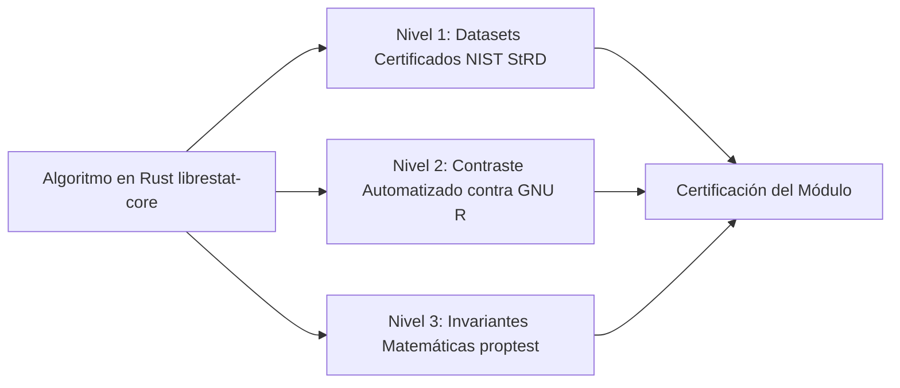

# TESTING.md: Estrategia de Pruebas y Validación Matemática de LibreStat

Este documento define el protocolo de pruebas, validación numérica, conjuntos de datos certificados y tolerancias matemáticas de **LibreStat**.

---

## 1. El Protocolo Tripartito de Validación Matemática

Para garantizar que ningún cálculo estadístico contenga errores numéricos, sesgos o pérdida de precisión, LibreStat implementa un protocolo de validación en tres niveles:



### 1.1. Nivel 1: Datasets Certificados del NIST StRD
El **NIST** (*National Institute of Standards and Technology*) provee conjuntos de datos de referencia estándar (*Standard Reference Datasets - StRD*) calculados con aritmética de precisión ultra-alta (hasta 500 dígitos significativos).
* Todo módulo de estadística univariada o regresión en LibreStat debe incluir pruebas automáticas que carguen directamente los archivos `.dat` del NIST en `tests/fixtures/nist/` y comparen los estimadores resultantes.
* **Datasets de Referencia Obligatorios**:
  - **Estadística Descriptiva Univariada**:
    - `PiFive`: evalúa la precisión cuando los números tienen muchos dígitos.
    - `Mavro`: conjunto de 50 observaciones de datos experimentales de laboratorio.
    - `Michelso`: mediciones de la velocidad de la luz (100 observaciones).
    - `NumAcc1` a `NumAcc4`: series sintéticas de la forma $x_i = 10^k + v_i$, diseñadas para forzar cancelación catastrófica en algoritmos que no utilicen el método de Welford.
  - **Regresión Lineal Simple y Múltiple**:
    - `Norris`: datos con excelente ajuste lineal ($R^2 \approx 0.9999$).
    - `Pontius`: regresión cuadrática y lineal con datos experimentales.
    - `Longley`: benchmark clásico con extrema colinealidad entre variables explicativas.

### 1.2. Nivel 2: Contraste Automatizado contra GNU R en CI
* En el entorno de Integración Continua (CI), GNU R se utiliza como validador externo de referencia (sin ser jamás una dependencia para el usuario final).
* Un script automatizado genera datos aleatorios con semillas fijas, los ejecuta a través de scripts de R (`tests/r_reference/run_benchmarks.R`) y serializa los resultados en JSON para ser contrastados contra `librestat-core`.
* Se validan:
  - Grados de libertad exactos (ej. aproximación de Satterthwaite para la prueba $t$ de Welch).
  - Valores p bilaterales y unilaterales.
  - Estadísticos de prueba ($Z, t, F, \chi^2$) e intervalos de confianza al $95\%$ y $99\%$.

### 1.3. Nivel 3: Pruebas Basadas en Propiedades (`proptest`)
Mediante el crate `proptest`, se generan miles de vectores de datos aleatorios para contrastar identidades matemáticas e invariantes universales:
1. **No-negatividad de la varianza**: $\forall X, \text{Var}(X) \ge 0$.
2. **Linealidad de la media**: $\text{Mean}(aX + b) = a \cdot \text{Mean}(X) + b$.
3. **Escalamiento de la varianza**: $\text{Var}(aX + b) = a^2 \cdot \text{Var}(X)$.
4. **Monotonía de la CDF**: Si $x_1 < x_2 \implies \text{CDF}(x_1) \le \text{CDF}(x_2)$.
5. **Simetría de distribuciones**: Para la Normal y Student-$t$, $\text{CDF}(t, \text{df}) + \text{CDF}(-t, \text{df}) = 1$.
6. **Inversión de cuantiles**: $\text{Quantile}(\text{CDF}(x)) \approx x$ para todo $x$ en el dominio soportado.

---

## 2. Matriz de Tolerancias Numéricas Justificadas

No se aplica una tolerancia fija arbitraria ($\epsilon \le 10^{-10}$) de forma indiscriminada. Las tolerancias se determinan según el condicionamiento matemático del problema:

| Procedimiento / Métrica | Tolerancia Relativa ($\epsilon_{rel}$) | Tolerancia Absoluta ($\epsilon_{abs}$) | Justificación Matemática |
| :--- | :--- | :--- | :--- |
| **Media Muestral ($\bar{X}$)** | $10^{-14}$ | $10^{-14}$ | Algoritmo de Welford con acumulador `f64` (53 bits de significando). |
| **Varianza y Desv. Estándar ($s^2, s$)** | $10^{-12}$ | $10^{-12}$ | Método de sumas cuadráticas estables de Welford. |
| **Estadísticos t y Z** | $10^{-11}$ | $10^{-11}$ | Diferencia de medias dividida por el error estándar. |
| **P-values ($10^{-4} \le p \le 1 - 10^{-4}$)** | $10^{-10}$ | $10^{-10}$ | Precisión de funciones especiales de `statrs`. |
| **P-values Extremos ($p < 10^{-8}$)** | $10^{-6}$ | $10^{-15}$ | Las colas muy alejadas sufren subdesbordamiento (*underflow*) en precisión doble estándar. |
| **Coeficientes de Regresión ($\beta_i$)** | $10^{-10}$ | $10^{-10}$ | Descomposición QR de Householder con `faer`. |
| **Sumas de Cuadrados ANOVA (SS)** | $10^{-10}$ | $10^{-10}$ | Cálculo ortogonal sobre los residuos de la proyección. |

---

## 3. Pruebas de Integración y de Interfaz de Usuario

* **Pruebas de Componentes Frontend**: Pruebas con Vitest y React Testing Library para componentes y custom hooks (`src/components/`, `src/features/`).
* **Pruebas End-to-End (E2E)**: Pruebas con Playwright sobre la aplicación empaquetada en Tauri para validar:
  - Carga y navegación de hojas de cálculo con 100.000 filas sin bloqueos.
  - Flujo completo: Importar CSV -> Ejecutar Estadística Descriptiva -> Verificar salida en Ventana de Sesión.
  - Renderizado correcto de gráficos y exportación a archivos SVG válidos.

---

## 4. Ejecución de las Suites de Pruebas

```bash
# 1. Pruebas unitarias y matemáticas en Rust
cargo test --workspace

# 2. Pruebas específicas de validación NIST
cargo test -p librestat-core --test nist_univariate
cargo test -p librestat-core --test nist_regression

# 3. Pruebas de propiedades con proptest
cargo test -p librestat-core --test property_tests

# 4. Pruebas de frontend
pnpm test
```
